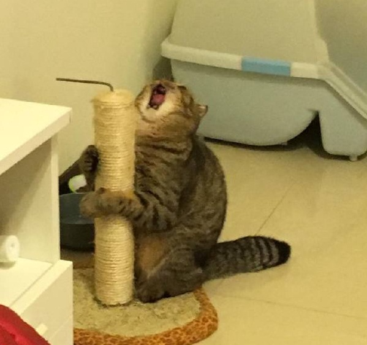

A List Sample
=============

* One
* Two
* Three

This is a paragraph ~~of stuff~~.  It will be displayed in
the `browser` or maybe only 1/2 of it will be.

> Quoted text.

# Code Snippet

```go
func getTrue() bool {
    return true
}
```

## Definition lists

Cat
: _Fluffy_ animal everyone **likes**.

Internet
: Vector of *transmission* for pictures of [cats](https://en.wikipedia.org/wiki/Cat).


### Footnotes and Line Breaks

This is a footnote followed by some extra line breaks.[^1]

\
\
\
\

[^1]: Footnote text.  Embrace the cat.


### A Table

Name    | Age
--------|----
Bob     | 27
Alice   | 23

Images
------



